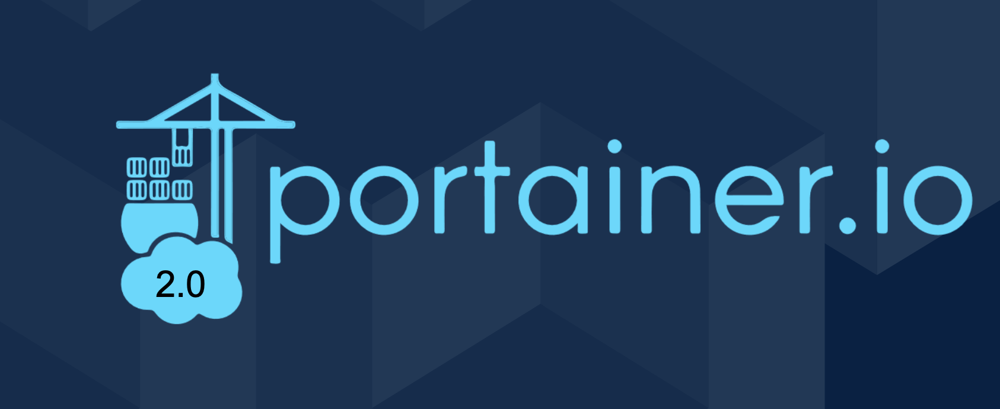

# Workshop MyNetflix part. 1

*Ce workshop a pour but de vous familiariser avec Docker et Portainer en mettant en place un serveur Plex pour pouvoir visionner des medias téléchargés au préalable grâce à un Docker transmission.*

**N'hésitez pas à star ⭠ce repo si vous avez aimé le workshop!** 

Ce workshop est divisé en deux parties.  
1️⃣ La première concerne l'installation d'un conteneur Docker portainer; le déploiement d'un serveur de distribution de média Plex et le déploiement d'une interface de téléchargement de torrents grâce à transmission.

2️⃣ La seconde partie concerne la mise en place d'un "stack" via Dokcer-compose pour voir monter de dé-monter facilement tout nos conteneurs en une seule commande et l'installation de **sonarr/radarr/jackett** pour automatiser le téléchargement de nos médias.

>Si vous voulez prendre économiser un peu de temps, vous pouvez pré-télécharger les images que nous allons utiliser grâce aux commandes:
``docker pull linuxserver/plex``  
``docker pull linuxserver/transmission``

## Partie 1 : Portainer et Plex
### 1 - Portainer

**Portainer** est un outil de gestion de conteneur Docker et/ou de Kubernetes. Nous allons l'utiliser pour gérer les conteneurs que nous allons créer dans le futur.

Tout d'abord, installez portainer en suivant le [portainer quick start](https://documentation.portainer.io/v2.0/deploy/ceinstalldocker/)

Ensuite, rendez vous [localhost:9000](http://localhost:9000) (ou le port que vous avez spécifié.)

Choisissez un mot de passe administrateur et sélectionnez l'utilisation **locale**.

✨ **Voilà !** ✨Vous avez maintenant une installation fonctionelle de portainer. 🐋

### Création d'une conteneur via l'interface portainer
#### Plex

Nous allons mainteannt procéder à l'installation de [plex](https://www.plex.tv/)

Rendez-vous dans la section "Containers" de portainer 

Pour savoir quelles variables d'environnement utiliser, utilisez la [page wiki linuxserver plex](https://hub.docker.com/r/linuxserver/plex)

Vous pouvez créer un volume pour stocker vos données (Portainer -> Volumes -> Create)
ou utiliser un bind qui attribuera un dossier dans le conteneur a un dossier en local. (une passerelle)

| Env variable | Value |
|--------------|-------|
| VERSION      | docker|

| Volume       |  Value                | Type
|--------------|-----------------------|------
| /config      | /home/pi/.config      | Volume
| /tv          | /home/pi/media/tv     | Volume
| /movies      | /home/pi/media/movies | Volume

Si vous ne savez pas quoi remplir, ne vous en faites pas. Portainer laisse la possibilité de modifier un conteneur existant.

Lancez maintenant Plex et rendez-vous sur [localhost:32400/web](http://localhost:32400/web) pour configurer la configuration de plex. Créez un compte et ajoutez vos dossiers media dans la librairie plex. 
Vous pouvez maintenant rajouter du contenu en local pour tester que plex fonctionne correctement.

## Partie 2 - Transmission Web Interface

Nous allons maintenant nous intéressés à la partie téléchargement des medias, qui seront ensuite automatiquement ajoutés dans plex.

Déployez un conteneur Dokcer transmission avec l'image [transmission linuxserver](https://hub.docker.com/r/linuxserver/transmission)

**⚠N'oubliez pas de publier le port 9091 pour avoir accès au WebUI (interface de téléchargement)**

**⚠ N'oubliez pas de rajouter vos binds / volumes médias dans la config du contenur. Sinon vous n'aurez pas d'endroit où stocker vos torrents.**

Si tout c'est bien passé, vous deviez maintenant être en mesure d'ajouter des torrents qui, une fois téléchargés, seront automatiquement intégrés à Plex.

Pour faciliter le travail de plex, il serait intélligent de déplacer les torrents par type et par état (en cours / terminés.)

## Conclusion

Merci d'avoir suivi ce workshop ! J'espère qu'il vous à plu. Et encore une fois si c'est le cas n'hésitez pas à star le repo, ça fait toujours plaisir 😉